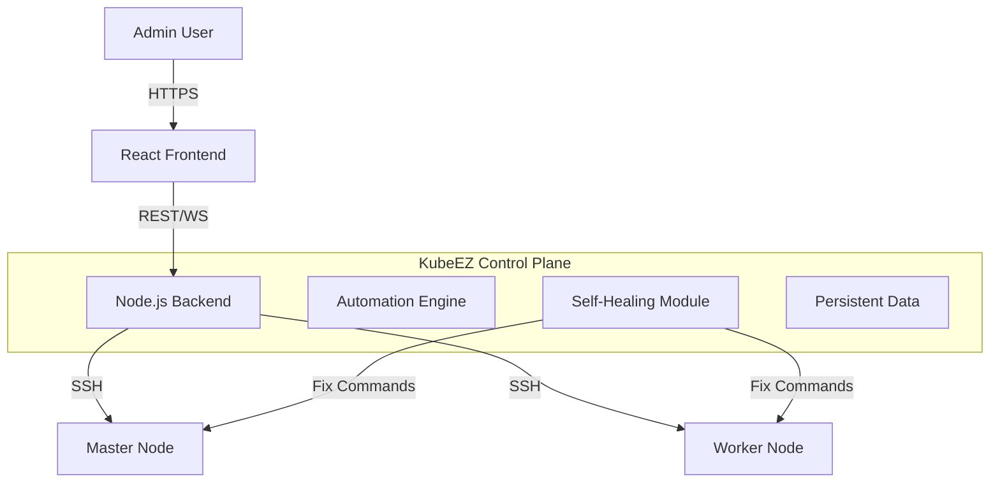

# 🚀 KubeEZ: The Intelligent Kubernetes Platform

[](LICENSE)
[](CHANGELOG.md)
[](README.md)
[](CONTRIBUTING.md)

**KubeEZ** is a production-grade, "No-Ops" platform designed to provision, scale, and manage Kubernetes clusters with zero friction. Built with an integrated AI-driven recovery engine, KubeEZ goes beyond simple installation by diagnosing and auto-repairing infrastructure issues in real-time.

---

## 📑 Quick Navigation

| Document | Description |
| :--- | :--- |
| [📂 **User Guide**](USER_GUIDE.md) | **Start Here!** Step-by-step instructions for installation and management. |
| [🛠️ **Setup Guide**](SETUP.md) | Technical prerequisites and platform deployment instructions. |
| [🛡️ **Security**](SECURITY.md) | Overview of security measures, SSH handling, and authentication. |
| [🧪 **Real Installation**](REAL_INSTALLATION_GUIDE.md) | Guide for deploying on real physical or virtual machines. |

---

## 🔥 Why KubeEZ?

### 🧠 Self-Healing Intelligence
Most installers fail and leave you guessing. KubeEZ's **Integrated Recovery Engine** analyzes stderr in real-time:
- **Auto-Fix DNS**: Patches networking on the fly.
- **Lock Recovery**: Safely handles stuck `apt`/`dpkg` processes.
- **Pre-flight Repair**: Disables swap and configures kernel modules automatically.

### 🔭 Visual Orchestration
- **3D Digital Twin**: Visualize your cluster topology and real-time traffic in an interactive 3D map.
- **Orbital Terminal**: Broadcast commands to all nodes simultaneously through a beautiful Glassmorphism UI.
- **Live Telemetry**: Monitor core metrics (CPU, Memory, Pods) directly from your dashboard.

### 🌍 Universal Compatibility
Supports all major Linux distributions including Ubuntu, Debian, RHEL, CentOS Stream, AlmaLinux, Rocky Linux, and Oracle Linux.

---

## ⚡ Quick Start (Local Deployment)

Get the KubeEZ platform running on your local machine in seconds using Docker:

1. **Clone the Repository**:
   ```bash
   git clone https://github.com/ckmine11/Universal-K8s-Installer.git
   cd Universal-K8s-Installer
   ```

2. **Launch via Compose**:
   ```bash
   docker-compose up -d --build
   ```

3. **Explore**:
   Open [http://localhost:5173](http://localhost:5173) to start building your first cluster!

---

## 🏗️ Architecture



The Backend acts as an **Orchestrator**. It pushes verified idempotent Bash scripts to target nodes. If a script fails (exit code != 0), the **Self-Healing Module** intercepts the stderr, calculates a fix strategy, executes it, and auto-retries the step.

---

## 🚀 Getting Started

### Prerequisites
- **Docker** and **Docker Compose**.
- Target Linux Servers (or use Simulation Mode).

### Quick Start
1. **Clone the Repository**:
   ```bash
   git clone https://github.com/ckmine11/Universal-K8s-Installer.git
   cd Universal-K8s-Installer
   ```

2. **Launch via Compose**:
   ```bash
   docker-compose up -d --build
   ```

3. **Access**:
   Open [http://localhost:5173](http://localhost:5173).
   - **Username**: `admin`
   - **Password**: `admin`
   - Start building your first cluster!

---

## 🔐 Security

- **JWT Authentication**: All API endpoints (including Recovery actions and Downloads) are secured.
- **SSH Key Handling**: Supports direct key content (no file dependency).
- **Persistent Sessions**: Cluster state is saved to disk, surviving container restarts.

---

## 📂 Project Structure

- `frontend/`: React-based dashboard with Glassmorphism UI and 3D visualization.
- `backend/src/automation/`: Production-ready Bash scripts for K8s lifecycle management.
- `backend/src/services/`: The core engine handling SSH coordination and AI diagnostics.
- `backend/data/`: Persistent storage for cluster configurations and backups.

---

## 🤝 Contributing

We love contributions! Please read our [Contributing Guide](CONTRIBUTING.md) to get started.

Built with ❤️ by the **KubeEZ Team**.
