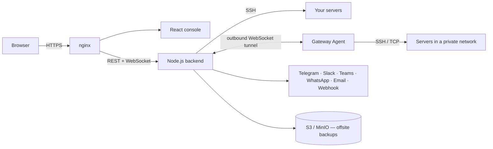

# KubeEZ — Kubernetes made easy

**Install, upgrade, back up and heal production Kubernetes clusters on your own servers — from one console.**
Every step streams a live log, and when something fails you get the reason and the fix, not a stack trace.

> Repository: `Universal-K8s-Installer` · Product: **KubeEZ** · Hosted edition: [k8scluster.space](https://k8scluster.space)

---

## What it does

| | |
|---|---|
| **Deploy** | Guided wizard with pre-flight checks (OS, CPU, memory, ports, connectivity). Kubernetes **1.27 → 1.37**, Flannel or Calico. **High availability** with 3 control-planes behind a floating virtual IP (**kube-vip**). Stopped installs **resume** — finished steps are skipped. |
| **Upgrade** | One minor version at a time, with an **upgrade safety check** (removed APIs, version skew, blocking disruption budgets), an automatic etcd snapshot first, clear failure reasons and retry. |
| **Add-ons** | Nginx Ingress, Prometheus + Grafana, Kubernetes Dashboard, cert-manager, Longhorn, ArgoCD, S3 storage (SeaweedFS), Velero, **KubeEZ Explorer** — install, repair, reinstall, uninstall and logs from the UI. |
| **Backups** | Verified **etcd snapshots** with a preview of what a restore changes, automatic rollback and undo (HA clusters too) · **volume data** backups (Velero) · **encrypted offsite copies** (S3 / MinIO / any S3) · **disaster recovery** of a lost control-plane · daily config backups. |
| **Auto-healing** | Nodes, control plane (API, scheduler, controller-manager, etcd), certificates, disk, pods, workloads, volume claims and jobs are checked every 1–2 minutes. Known problems are fixed automatically (with verification and retries), the rest are diagnosed with evidence. **Warns before things break:** disk-fill forecast per node ("full in ~9 h", cleaned up before it is), CPU / memory above 90 % for 15 min with the pods responsible, and live node usage bars. Root-cause grouping, a timeline per incident, policies (fix / alert only / off), maintenance mode, MTTR and fix-rate statistics. |
| **Alerts** | Telegram, Slack, Microsoft Teams, WhatsApp (Twilio), email and webhooks — incidents, failed backups, restores, upgrades, finished jobs, Gateway Agent offline / back online. Quiet hours with a morning summary, cooldown, per-event rules, **routing** per channel (clusters, minimum severity) and **escalation** when nobody acknowledges. **Act from the alert:** Acknowledge / Mute / Fix now buttons in Telegram, signed confirmation links everywhere else. |
| **Explorer** | A full Kubernetes UI inside KubeEZ (based on [Radar](https://github.com/skyhook-io/radar), Apache-2.0): every resource, logs, timeline, Helm, GitOps and a 31-check audit — with your KubeEZ login and role, no open ports. |
| **Reach anything** | **Gateway Agent**: servers in private networks are managed through an outbound tunnel — no inbound firewall ports. |
| **Teams** | Isolated workspaces with Admin / Operator / Viewer roles; viewers never see credentials. Sign in with username or email, forgot-password by email code, welcome and invite emails. |

**Supported node OS:** Ubuntu 22.04 / 24.04, Debian 12, Rocky Linux 9, AlmaLinux 9, Fedora, Amazon Linux 2023 (all tested end-to-end), RHEL 8 / 9. Kubernetes 1.35+ needs cgroups v2 — CentOS 7 / RHEL 7 are supported up to Kubernetes 1.34.

---

## Quick start

Requirements: **Docker** with Docker Compose. The nodes you want to turn into a cluster need SSH (self-hosted) or a Gateway Agent (SaaS).

```bash
git clone https://github.com/ckmine11/Universal-K8s-Installer.git
cd Universal-K8s-Installer
cp .env.example .env          # set APP_SECRET (openssl rand -hex 32) and, for email, the SMTP_* values
docker compose up -d --build  # development: frontend :5173, backend :3000
```

Open **http://localhost:5173**. On a fresh self-hosted server the first screen creates the **first administrator** — there is no default password.

### Production

```bash
docker compose -f docker-compose.prod.yml up -d --build   # nginx proxy on :80 (and :8090) → frontend + backend
```

Put it behind HTTPS (e.g. Cloudflare, see [CLOUDFLARE_SETUP.md](CLOUDFLARE_SETUP.md)). In SaaS mode the platform owner account is created with:

```bash
docker exec -it kubeez-backend node scripts/make-superadmin.js <username> <password> <email>
docker compose -f docker-compose.prod.yml restart backend
```

Update a running server:

```bash
git pull && docker compose -f docker-compose.prod.yml up -d --build backend frontend
```

---

## Configuration (`.env`)

| Variable | Purpose |
|---|---|
| `APP_SECRET` | **Required.** Encrypts stored credentials and signs sessions — 64 random hex characters. Keep it; changing it makes stored secrets unreadable. |
| `KUBEEZ_MODE` | `saas` (hosted, nodes through Gateway Agents) or `selfhosted` (direct SSH, license key). |
| `KUBEEZ_PUBLIC_URL` | Public address (e.g. `https://k8scluster.space`) — used in alert and email links. |
| `ALLOWED_ORIGINS` | Extra browser origins allowed to call the API (the site's own address always is). |
| `SMTP_HOST`, `SMTP_PORT`, `SMTP_SECURE`, `SMTP_USER`, `SMTP_PASS`, `EMAIL_FROM`, `EMAIL_REPLY_TO` | Email: password reset codes, welcome / invite emails, email alerts. Port 465 = TLS, 587 = STARTTLS. Gmail needs an App Password; for inbox delivery use your own domain via Brevo / Resend / SES with SPF, DKIM and DMARC. |
| `ALERT_EMAILS_PER_DAY_FREE`, `ALERT_EMAILS_PER_DAY_PAID` | Daily alert-email allowance per workspace (default 20 / 200). |
| `STRIPE_*` | Billing (hosted edition). |

See [.env.example](.env.example) for the full list.

---

## How it works


```mermaid
graph LR
    Browser -->|HTTPS| Proxy[nginx]
    Proxy --> FE[React console]
    Proxy -->|REST + WebSocket| BE[Node.js backend]
    BE -->|SSH| Nodes[Your servers]
    BE <-->|outbound WebSocket tunnel| Agent[Gateway Agent]
    Agent -->|SSH / TCP| Private[Servers in a private network]
    BE --> Alerts[Telegram · Slack · Teams · WhatsApp · Email · Webhook]
    BE --> S3[(S3 / MinIO — offsite backups)]
```

The backend pushes idempotent Bash scripts (`backend/src/automation/`) to the nodes over SSH or through a Gateway Agent and streams their output to the browser. Machine-readable result lines (`KUBEEZ_FAIL|code|reason|fix`, `KUBEEZ_PROGRESS|…`) turn failures into a reason and a fix on screen. Auto-healing keeps one SSH session per cluster and polls nodes, pods and cluster health; playbooks fix or diagnose, then verify.

---

## Project layout

```
frontend/                 React + Vite + Tailwind console ("Aurora Glass" theme)
  src/pages/              Clusters, Incidents, Alerts, Gateway Agents, Settings, Docs …
  src/components/shell/   Sidebar, top bar, Ctrl+K search
backend/
  src/routes/             REST API
  src/services/           automation engine, auto-healing (incidentDetector, remediationEngine),
                          alerts (notifier), backups, Explorer proxy, Gateway Agent service
  src/automation/         Bash scripts: install, join, upgrade, etcd backup / restore, recovery, add-ons
  scripts/                make-superadmin.js, reset-password.js, license tools
  tests/                  node:test suites (npm test)
tests/e2e/                end-to-end runs on real distros in Docker (install, upgrade, HA, restore, recovery, Velero, Explorer, agent)
nginx/                    production reverse proxy
```

---

## Development & tests

```bash
cd backend && npm install && npm test        # API, auth, alerts, auto-healing, backups … (node:test)
cd frontend && npm install && npm run dev    # console with hot reload on :5173 (API proxied to :3000)
bash tests/e2e/e2e.sh install ubuntu2204      # real kubeadm install in a systemd container (needs Docker, cgroups v2)
bash tests/e2e/e2e.sh ha-vip ubuntu2204       # 3 control-planes + kube-vip failover
```

Node.js **20 or newer** (the Docker images use Node 22 LTS).

---

## Security

- Node passwords, SSH keys, bot tokens and webhook URLs are **encrypted at rest** (`APP_SECRET`) and never sent back to the browser.
- Sessions are httpOnly cookies; a password change or reset ends all other sessions; per-account login lockout; CSRF-safe same-site checks.
- Workspaces are isolated; roles are enforced by the API, not only the UI.
- In SaaS mode the server never opens direct SSH connections or webhook requests to private / internal addresses (SSRF) — private servers are reached only through their own Gateway Agent.
- The KubeEZ Explorer is reachable only through KubeEZ's authenticated proxy — no ports are opened in the cluster.

Found a vulnerability? Please report it privately to the maintainers instead of opening a public issue.

---

## More documentation

The full user guide is built into the console (**Help → Docs**). In this repository: [DEPLOY.md](DEPLOY.md) · [TROUBLESHOOTING.md](TROUBLESHOOTING.md) · [CLOUDFLARE_SETUP.md](CLOUDFLARE_SETUP.md) · [THIRD_PARTY_NOTICES.md](THIRD_PARTY_NOTICES.md) · [CHANGELOG.md](CHANGELOG.md) · [CONTRIBUTING.md](CONTRIBUTING.md)
